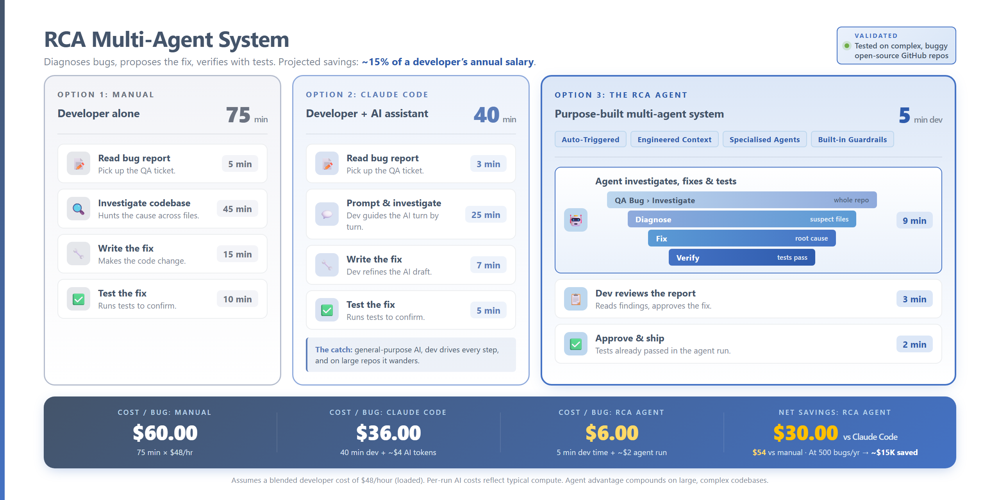

# AI-Powered Bug Diagnosis and Resolution

> **Bug investigation, compressed.** A purpose-built multi-agent system that diagnoses bugs, proposes the fix, and verifies it with tests &mdash; so the developer only reviews and ships.

<p align="center">
  
</p>

|          5 min         |           $6          |                   ~15%                  |              $30              |
|:----------------------:|:---------------------:|:---------------------------------------:|:-----------------------------:|
| developer time per bug | cost per bug resolved | of a developer's salary saved annually  | saved per bug vs vibe coding  |

> Validated on real, complex, buggy open-source GitHub repositories (pallets/click).

---

## Getting Started from Scratch

A complete walk-through for someone who has never run this before. End-to-end takes about 10 minutes the first time.

### 1. Install prerequisites

You need four things on the machine that will run the agent:

| Tool | Why | Install check |
|---|---|---|
| **Claude Code CLI** | The agents are LLM calls; this is the binary that makes them | `claude --version` |
| **git** | Used for blame, log, diff, and worktree isolation in validation mode | `git --version` |
| **jq** | All structured outputs are JSON; jq parses them | `jq --version` |
| **bash** | The orchestrator is bash. On Windows, install **Git Bash** (ships with Git for Windows) or WSL. PowerShell will not work. | `bash --version` |

Optional but recommended:

- **ripgrep (`rg`)** — makes the briefing step ~10× faster on large repos. Falls back to `git grep` if absent.
- **GitHub CLI (`gh`)** — only needed if you want `--issue <NUM>` input.

Then log in to Claude Code once:

```bash
claude auth login
```

### 2. Clone this repo

```bash
git clone https://github.com/<your-fork>/MAS_final.git
cd MAS_final
```

The agent lives in `rca-mas/`. The entry point is `rca-mas/rca-mas.sh`.

### 3. Write your first bug report

Create a file called `my_bug.md` anywhere. It should describe what the user expected vs. what happened, with concrete error messages or unexpected output **in quotes or fenced code blocks** (the briefing step pulls quoted strings out as grep targets).

A good minimal example:

````markdown
# Discount lookup returns None for valid coupon codes

When calling `apply_discount(cart, "SUMMER25")` from the checkout flow,
the function returns `None` instead of the expected discount object.

Stack trace:

```
TypeError: 'NoneType' object has no attribute 'discount_value'
  at src/cart/pricing.py:42 in apply_discount
```

Steps to reproduce:

1. Add any item to cart
2. Call `apply_discount(cart, "SUMMER25")`
3. Expected: discount applied. Actual: TypeError.
````

The richer and more specific the bug report, the better the diagnosis. Mention file paths if you know them — the briefing step will validate they exist in the repo before passing them to the agent.

### 4. Run the agent against the target repo

The agent runs **inside the repo it is analysing**. So `cd` into that repo first, then call the script with an absolute path:

```bash
cd /path/to/the/target/repo
/path/to/MAS_final/rca-mas/rca-mas.sh /path/to/my_bug.md
```

You'll see stage-by-stage progress in the terminal:

```
[rca-mas] Run 1778649108-c88f333 starting (report-only)
[rca-mas] Briefing...
[rca-mas] Briefing: scanning repo...
[rca-mas] Briefing: 141 files, tier=S, turns=50, errors=5
[rca-mas] Agent 1a: investigation...
[rca-mas] Agent 1b: conclusion...
[rca-mas] Agent 2: solution...
[rca-mas] Report...
[rca-mas] Report: /path/to/repo/.rca-mas/runs/1778649108-c88f333/report.md
```

Expected wall time on an S-tier repo (~150 files): **6–11 minutes** depending on bug complexity and platform (briefing 50–90s, investigation 2–5min, diagnosis 80–110s, solution 95–125s). Windows Git Bash adds ~30–60s of shell overhead vs Linux/macOS.

### 5. Read the report

The report is always at the same convenient path:

```bash
cat .rca-mas/runs/latest/report.md
```

It contains: root cause, confidence score, evidence (file:line references), proposed fix as a unified diff, risk level, and what to do next. If the agent could not confidently diagnose, you'll see a `NO_FIX` recommendation with an explanation of what's missing rather than a guessed patch.

### 6. Review and apply the patch (manually)

Always preview first, then apply if the dry-run is clean:

```bash
# Dry-run: validates the patch applies cleanly to current HEAD without changing anything
git apply --check .rca-mas/runs/latest/patches/fix.diff

# Apply the patch for real (only if --check succeeded)
git apply .rca-mas/runs/latest/patches/fix.diff
```

The agent **never modifies your source code in default mode**. Every change goes through your hands.

### 7. Automated patch verification with `--validate`

Run with `--validate` to have the agent apply the fix in an isolated git worktree, run your existing test suite against it, and write a regression test that captures the original bug. The developer's working tree is never touched.

```bash
./rca-mas.sh bug.md --validate
```

The verification stage (Agent 2.5) produces `validation.json` with one of: `TESTS_PASSED`, `TESTS_FAILED`, `TEST_CREATED`, `GENERATED_BUT_NOT_VERIFIED`, `VALIDATION_FAILED`, or `NOT_RUN_NO_COMMAND` (when no test runner is detected). The worktree is removed at the end of the run unless you set `RCA_KEEP_WORKTREE=1` to inspect it.

The developer still decides whether to merge. The verification stage proves the fix works in isolation; promoting it to the main tree always stays with you.

### 8. Run it from Claude Code chat (no terminal)

If you live in Claude Code, you can drive the whole pipeline from chat instead of the terminal. One-time setup, then natural-language prompts like *"use rca-mas to investigate this bug"* or *"use rca-mas to find the issue in bug.md"* just work.

**One-time setup (per target repo):**

1. Copy or clone the `rca-mas/` folder into your target repo so it lives at `<your-repo>/rca-mas/`. Add `rca-mas/` and `.rca-mas/` to that repo's `.gitignore` (the tool and its run artifacts should not be committed).
2. Append the contents of [rca-mas/templates/CLAUDE.md.snippet](rca-mas/templates/CLAUDE.md.snippet) to your target repo's `CLAUDE.md` (create one at the repo root if absent). That snippet teaches Claude Code what *"use rca-mas to ..."* means.
3. Open Claude Code with the target repo as the working directory.

**Then in chat:**

> use rca-mas to find the issue in bug.md

Claude Code will run `bash ./rca-mas/rca-mas.sh bug.md`, optionally tail `log.jsonl` while it runs, and at the end show you `report.md` and the proposed `fix.diff`. It will not apply the patch — that decision stays with you.

Other natural phrasings the snippet recognises:

| Say this | What happens |
|---|---|
| *"use rca-mas to investigate `<path/to/bug.md>`"* | Report-only run on that bug file |
| *"use rca-mas to diagnose the bug I just pasted"* | Saves your pasted text to `.rca-mas/bug.md`, then runs |
| *"use rca-mas on GitHub issue 42"* | `--issue 42` mode (requires `gh auth login`) |
| *"show me the last rca-mas report"* | `cat .rca-mas/runs/latest/report.md`, no re-run |
| *"use rca-mas to resolve this bug **with validation**"* | Adds `--validate` to apply the patch in an isolated worktree and run tests |

If you would rather not modify `CLAUDE.md`, you can paste this prompt verbatim into chat instead:

> Run `bash ./rca-mas/rca-mas.sh <path-to-bug.md>` from this repo's root. While it runs, tail `.rca-mas/runs/latest/log.jsonl` so I can see stage transitions. When it finishes, show me `report.md` in full and then `patches/fix.diff`. Do not apply the patch.

This is exactly what the snippet automates — without the snippet you just remember the prompt.

### 9. Skip writing markdown — use a GitHub issue directly

If the bug is already a GitHub issue:

```bash
/path/to/MAS_final/rca-mas/rca-mas.sh --issue 42 --repo owner/repo
```

The agent fetches the issue body via `gh issue view`, uses it as the bug report, and writes the issue URL into the run's `manifest.json`. Requires `gh auth login`.

> The `--issue` code path is implemented but the v1 lock-gate validation runs were all from local `bug.md` files. Treat the issue-input mode as a convenience shortcut that's been smoke-tested but not exercised on every variety of GitHub issue formatting.

### What to do if something goes wrong

| Symptom | First thing to check |
|---|---|
| `error: Claude Code CLI is required but not found. Run: claude auth login` | Install Claude Code CLI and authenticate. Confirm with `command -v claude`. |
| `error: git is required but not found.` / `error: jq is required but not found.` | Install the missing prerequisite. The CLI fails fast before any LLM cost is incurred. |
| `[rca-mas] Briefing: 0 files, tier=XS` | The current directory has no source files the briefing recognises. You're likely in the wrong directory — `cd` into the actual repo and re-run. |
| Status banner reads `⚠️ FIX proposed (based on weak evidence — review carefully)` and confidence shows 0.4 | The diagnosis was capped because upstream signal was thin. Treat the patch as a draft for human review. Try `RCA_MODEL=claude-opus-4-7 ./rca-mas.sh ...` or a richer bug report. |
| Status banner reads `🚫 NO_FIX — see reason below` | This is intentional — the agent refused to guess. Read the `Proposed Fix` section: it explains what evidence was missing and what to investigate next. |
| Patch fails `git apply --check` | The patch may be against a slightly different HEAD than your current working tree. Stash local changes or check out the original ref before applying. |

For deeper troubleshooting, see [rca-mas/docs/troubleshooting.md](rca-mas/docs/troubleshooting.md).

---

## TL;DR

A QA engineer files a bug. The system auto-triggers, and four specialised agents run in sequence:

| Stage | What happens |
|---|---|
| **Investigate** | Scans the whole repo to find what's relevant |
| **Diagnose** | Pins down the root cause in suspect files |
| **Fix** | Writes the unified-diff code change |
| **Verify** | Applies the patch in a sandboxed workspace, runs the test suite |

The developer receives a single `report.md`: root cause, evidence, the proposed fix, test results. They review, approve, and ship. **5 minutes of developer time per bug** versus 75 minutes manual or 40 minutes with general-purpose AI assistance.

```bash
./rca-mas.sh bug.md --validate
cat .rca-mas/runs/latest/report.md
```

---

## Why This Beats Vibe Coding

Most teams reach for Claude Code, Cursor, or Copilot when a bug lands. That works &mdash; but it's *vibe coding*: the developer prompts ad-hoc, the AI has no structure, and on large or messy repos it wanders, stalls, or fixates on the wrong file. Every step still needs the developer driving.

The RCA agent is **agentic**, not assistive:

- **Auto-triggered** &mdash; kicks off the moment the QA bug is filed
- **Engineered context** &mdash; each stage gets only what it needs, not the whole repo dumped in
- **Specialised agents** &mdash; one agent per job (investigate, diagnose, fix, verify), each with its own tools and guardrails
- **Built-in guardrails** &mdash; schema-enforced outputs, fail-closed on low confidence, sandboxed test execution
- **Reproducible artifacts** &mdash; every run produces a structured JSON + Markdown report you can archive and audit

---

## The Problem This Solves

In any software delivery team, bugs follow a predictable cycle:

1. Developer writes code, automated tests pass, code is merged
2. QA manually tests the application and finds a bug automated tests missed
3. QA raises a ticket on GitHub or JIRA
4. **Developer opens the ticket, opens the codebase, and spends 30–60 minutes** reading the report, searching files, tracing call chains, checking git history, forming a theory, and verifying it — all under sprint pressure

That 30–60 minute investigation window is the bottleneck this tool addresses. The agent does the search and triage; the developer gets a ready-to-act report.

---

## What It Produces

Given a bug report, the system outputs a `report.md` that contains:

- **Root cause** — the specific file, function, and line where the bug originates
- **Confidence score** — how certain the agent is (0–1)
- **Evidence** — file paths, line numbers, git blame, call chains backing the diagnosis
- **Competing hypotheses** — alternate explanations that were considered and rejected, with reasons
- **Proposed fix** — a unified diff ready for developer review
- **Risk assessment** — low / medium / high impact of applying the fix
- **New regression test** — a test written specifically for this bug scenario (validation mode)
- **Unknowns** — things the agent could not verify and that a human should check
- **Next action** — explicit instructions for what the developer should do next

---

## What the Agent Does NOT Do

This section is the most important one for anyone evaluating or deploying this system.

### The agent never makes decisions for humans

| Action | Who does it |
|---|---|
| Read the report and decide whether the diagnosis is credible | **Human (developer)** |
| Apply the proposed fix to the codebase | **Human (developer)** |
| Decide whether the fix is safe to deploy | **Human (developer + tech lead)** |
| Raise, assign, or close tickets | **Human (QA / project manager)** |
| Communicate the fix to stakeholders | **Human (developer / delivery manager)** |
| Decide whether to run the validation mode | **Human (developer)** |
| Judge whether the generated regression test is adequate | **Human (developer)** |

The system is a **reading and reasoning tool**, not an autonomous repair agent. It never touches application source code in default mode. Even in validation mode, changes are made only inside an isolated git workspace that is discarded after the run.

### What the agent cannot guarantee

- **It may be wrong.** Every report includes a confidence score. Scores below 0.7 should be treated as a starting point for investigation, not a conclusion. The developer must verify.
- **It cannot read environment state.** The agent reads source code and git history. It cannot observe running servers, database contents, live session state, infrastructure config, or anything outside the repository.
- **It cannot test end-to-end behaviour.** Validation runs unit or integration tests that exist in the repo. It does not simulate QA's manual testing steps.
- **It cannot assess business impact.** Whether a bug affects one user or ten thousand, whether it is a P1 or a P4 — that judgement belongs to the delivery team.
- **It cannot replace QA.** The system exists because manual QA finds bugs that automated tests miss. It does not eliminate that need.
- **It may miss bugs in external dependencies, infrastructure, or configuration.** It searches the repository it is pointed at.
- **Generated tests are labelled `GENERATED_BUT_NOT_VERIFIED`.** The developer must review and integrate them into the test suite.

---

## How to Use It

### Prerequisites

- [Claude Code CLI](https://claude.ai/code) installed and logged in
- `git`, `jq`, `bash` available on the machine
- `gh` (GitHub CLI) — only needed for `--issue` input mode

### Quickstart

```bash
# From a bug report file
./rca-mas.sh bug.md

# Read the report
cat .rca-mas/runs/latest/report.md

# Optional: validate the proposed fix in an isolated workspace
./rca-mas.sh bug.md --validate

# From a GitHub Issue directly
./rca-mas.sh --issue 42
./rca-mas.sh --issue 42 --repo owner/repo
```

### Two modes

| Mode | What happens | Touches source code? |
|---|---|---|
| `report-only` (default) | Diagnoses root cause, proposes fix as a diff | Never |
| `--validate` | Additionally applies fix in isolated git workspace, runs existing tests, writes a new regression test | Only inside a temporary isolated workspace, discarded after |

---

## How It Works — For Non-Technical Readers

Think of the system as three specialists working in sequence, each handing off to the next:

**Stage 1 — Triage (instant, no AI)**
Before any AI runs, a fast automated scan reads the bug report, maps the codebase structure, traces imports, and finds where relevant error messages appear in the code. This takes 2 seconds and costs nothing. It gives the AI agents a head start rather than having them fumble through the codebase from scratch.

**Stage 2 — Diagnosis (Agent 1)**
An AI agent with the profile of a senior QA engineer searches the full codebase. It reads files, traces call chains, checks git history, and builds at least two competing explanations for the bug. It documents the evidence for and against each hypothesis, critiques its own reasoning, and produces a structured diagnosis with a confidence score.

**Stage 3 — Solution (Agent 2)**
A separate AI agent — starting fresh with only the diagnosis, not the 30K tokens of exploration from Stage 2 — proposes a focused fix. It produces a unified diff, assesses the risk, and identifies which existing tests should be checked. If confidence is too low, it returns "NO FIX" rather than guessing.

**Stage 4 — Validation (Agent 2.5, optional)**
A third agent applies the proposed fix inside an isolated copy of the repository, runs the relevant existing tests to check for regressions, and writes a new test that specifically reproduces the QA-reported scenario. The isolated copy is deleted after the run. Nothing in the main codebase is changed.

**Stage 5 — Report**
All structured outputs are compiled into a single markdown report for the developer.

---

## Human Handoff Points

These are the moments where a human must engage. The system cannot proceed past these points on its own.

```
QA finds bug → raises ticket
      │
      ▼
  [HUMAN]  Developer decides to run the tool
      │
      ▼
  Agent pipeline runs (3–8 minutes)
      │
      ▼
  [HUMAN]  Developer reads report.md
           ├── Is the diagnosis credible? (confidence score + evidence)
           ├── Does the proposed fix make sense?
           └── Is the risk level acceptable?
      │
      ▼  (if yes)
  [HUMAN]  Developer applies the fix manually
      │
      ▼
  [HUMAN]  Developer reviews and integrates the generated regression test
      │
      ▼
  [HUMAN]  Code review by peers
      │
      ▼
  [HUMAN]  QA retests the fix
      │
      ▼
  [HUMAN]  Deployment decision by delivery manager / tech lead
```

The system accelerates the investigation step. Every decision step remains human.

---

## System Boundaries

```
┌─────────────────────────────────────────────────────┐
│                  INSIDE THE SYSTEM                  │
│                                                     │
│  Reading bug reports                                │
│  Searching source files (read-only)                 │
│  Checking git history                               │
│  Tracing import and call chains                     │
│  Generating diagnosis and hypotheses                │
│  Proposing a fix as a diff                          │
│  Running tests inside isolated workspace            │
│  Writing a regression test draft                    │
│  Producing report.md                                │
└─────────────────────────────────────────────────────┘

┌─────────────────────────────────────────────────────┐
│                 OUTSIDE THE SYSTEM                  │
│              (human responsibility)                 │
│                                                     │
│  Deciding whether the diagnosis is correct          │
│  Applying any fix to the codebase                   │
│  Code review and approval                           │
│  Deployment                                         │
│  Ticket management (JIRA / GitHub)                  │
│  Stakeholder communication                          │
│  Business impact assessment                         │
│  Reading environment, infrastructure, or DB state   │
│  End-to-end / regression / load testing             │
│  Security review of the proposed change             │
│  Dependency installation                            │
│  Any network operations                             │
└─────────────────────────────────────────────────────┘
```

---

## Output Files

Every run writes to `.rca-mas/runs/{RUN_ID}/`. The most recent run is always accessible at `.rca-mas/runs/latest/`.

| File | What it contains |
|---|---|
| `report.md` | **Start here.** Developer-facing report with root cause, fix, and next steps |
| `diagnosis.json` | Structured diagnosis: hypotheses, evidence, confidence, affected files |
| `solution.json` | Proposed fix, risk level, expected tests |
| `validation.json` | Test results and regression test status (validation mode only) |
| `patches/fix.diff` | Proposed fix as a unified diff — ready to review and apply |
| `patches/generated_test.diff` | New regression test as a diff — review before adding to test suite |
| `manifest.json` | Run metadata: timestamp, mode, git state, tool versions |
| `log.jsonl` | Structured event log for debugging |

---

## Confidence Scores — What They Mean

Every diagnosis carries a confidence score between 0 and 1.

| Range | Interpretation | Recommended action |
|---|---|---|
| 0.8 – 1.0 | Agent found strong, consistent evidence | Review evidence, apply fix if it looks right |
| 0.6 – 0.79 | Reasonable hypothesis with some gaps | Use as starting point; verify the unknowns section |
| 0.5 – 0.59 | Weak signal; multiple plausible causes | Investigate manually; treat report as a lead, not a conclusion |
| Below 0.5 | Agent could not confidently diagnose | System returns NO_FIX; report shows what was found and what remains unknown |

The report always shows the unknowns the agent could not verify. These are the things a developer should check manually before applying any fix.

---

## Technical Stack

No cloud services beyond Claude Code. No databases. No dashboards. No background workers.

| Component | Technology |
|---|---|
| Orchestration | Bash |
| AI agents | Claude Code CLI (Sonnet 4.6 default; configurable) |
| Structured output | JSON schemas via `--json-schema` flag |
| Code search | `rg` (ripgrep) with `grep` fallback |
| Isolated validation | `git worktree` |
| Data format | JSON on disk, JSONL for logs |
| Report format | Markdown |

---

## Limitations and Known Gaps (v1)

These are deliberate scope decisions, not bugs. They are documented so stakeholders can plan around them.

| Gap | Why it exists | Workaround |
|---|---|---|
| No JIRA / GitHub ticket update | Prevents accidental writes to shared systems | Developer copies findings manually |
| No Slack / Teams notification | Same reason | Developer shares `report.md` manually |
| No web dashboard | Out of scope for v1; adds infrastructure complexity | Read `report.md` directly |
| Generated tests not red-green verified | Would require running the test suite twice (before and after fix), doubling cost | Developer runs tests manually; tests are labelled `GENERATED_BUT_NOT_VERIFIED` |
| No multi-repo tracing | Agent searches one repository per run | Run separately on each repo if bug spans services |
| No environment / infra visibility | Agent reads only source code and git history | Developer checks infra config manually |
| No evaluator-optimizer retry | Agent 1 runs once; no automatic retry on low-confidence output | Re-run manually with adjusted parameters |

---

## For Delivery Managers and Consultants

**What this changes in the delivery workflow:**

- The investigation phase of a bug cycle shrinks from 30–60 minutes to 3–8 minutes
- Developer time is spent on decision-making and fixing, not searching
- Every bug investigation produces a structured artifact (the report) that can be reviewed, archived, and referenced
- Generated regression tests, when reviewed and integrated, reduce the chance the same bug recurs

**What this does not change:**

- QA remains essential — the system depends on QA finding and reporting bugs
- Code review, approval, and deployment processes are unchanged
- Developers remain accountable for every fix they apply
- The tool does not produce SLA metrics, ticket velocity, or any reporting — those remain in your existing project management tools

**Risk posture:**

- Default mode is read-only with no writes to source code
- No credentials, tokens, or secrets are read or logged
- The system cannot push code, open PRs, or deploy
- All proposed changes are presented as diffs for human review before anything is applied

---

## Further Reading

| Document | Audience |
|---|---|
| [architecture.md](architecture.md) | Engineers building or tuning the system — agent parameters, data flows, schemas |
| `docs/agent-contracts.md` | Engineers — exact tool permissions and output contracts per agent |
| `docs/security-model.md` | Security reviewers — trust boundaries, denied operations, prompt injection defence |
| `docs/decisions.md` | Anyone wondering why something was built a certain way |
| `docs/troubleshooting.md` | Engineers debugging a failed run |
